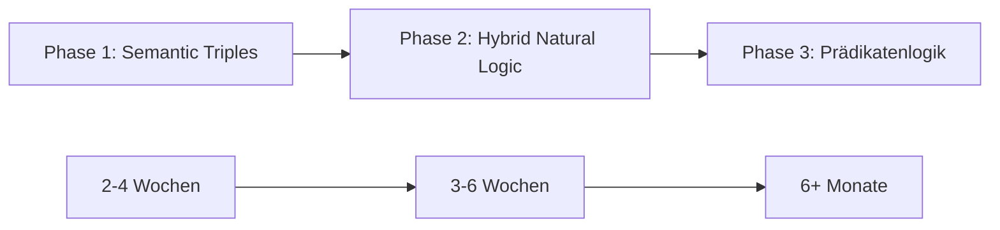

# LocalInsightEngine 🚀 - Developer Documentation

**Enterprise-Ready Document Analysis with FTS5 Semantic Search**

Vollständig funktionsfähige Python-Anwendung zur copyright-compliant Dokumentenanalyse mit modernster FTS5-Volltextsuche und persistenter Q&A-Session-Verwaltung.

## 🆕 Version 0.1.1 - Enterprise Features

### 🚀 Neue Architektur-Komponenten

- **🔍 FTS5 Semantic Search Engine**: SQLite-basierte Volltext-Suche mit BM25-Ranking
- **🗄️ Persistent Q&A Sessions**: Automatische SQLite-Persistierung aller Analyse-Sessions
- **📊 Enhanced Debug Logging**: Comprehensive Performance-Tracking und detaillierte Analyse-Logs
- **⚙️ Konfigurationssystem**: `localinsightengine.conf` für alle System-Einstellungen
- **🚀 Database Auto-Creation**: Automatische SQLite-DB-Erstellung mit WAL-Mode
- **🎯 Smart Q&A System**: Multi-Layer Search (FTS5 → Keyword → Fallback)
- **📈 Performance Monitoring**: Detaillierte Metriken für alle Operationen
- **🔄 Robust Fallback Systems**: Graceful Degradation bei Database/FTS5-Fehlern

### ✨ Core Features

- **📖 Sachbuch-Modus**: Bypass für faktische Inhalte - keine Anonymisierung wissenschaftlicher Begriffe
- **🔒 Urheberrechtskonform**: Niemals Originaltext an externe APIs (außer im bewusst gewählten Sachbuch-Modus)
- **🏗️ 5-Layer-Architektur**: Erweitert um Persistence und Utils Layer
- **🇩🇪 Deutsche & Englische NLP**: spaCy-basierte Named Entity Recognition
- **🤖 Claude-4 Integration**: Modernste KI-Analyse mit intelligenten Insights
- **📁 Multi-Format Support**: PDF, TXT, EPUB, DOCX mit automatischer Erkennung
- **🔍 File-Type Validation**: Erkennt echten Dateityp unabhängig von Extension
- **📊 Vollständige Nachverfolgbarkeit**: Jede Erkenntnis zurück zur Quelle verfolgbar
- **🧪 Umfassende Tests**: Unit-, Integration- und Multi-Language Tests

## 🚀 Next Generation: Semantic Triples Pipeline (In Development)

### 🧠 Aussagenlogische Architektur Vision

**Problem:** Aktuelle Neutralisierung verliert semantische Beziehungen und Kontext für präzise Q&A.

**Lösung:** Transformation von Sätzen in aussagenlogische **Semantic Triples** für wissenschaftliche Sachbücher.

### 📐 Evolution Path



### 🔄 Dual-Pipeline Architektur

**Branch:** `feature/aussagenlogische-sachbuch-pipeline`

```python
# Belletristik (Urheberrechtsschutz)
if literary_mode:
    neutralized = neutralize_content(text)

# Sachbücher (Wissenschaftliche Fakten)
if factual_mode:
    triples = extract_semantic_triples(text)
```

### 🎯 Semantic Triples Format

**Input:** "Vitamin B3 unterstützt den Energiestoffwechsel und ist wasserlöslich."

**Output:**
```python
[
    ("Vitamin_B3", "supports", "Energy_Metabolism"),
    ("Vitamin_B3", "has_property", "water_soluble"),
    ("Vitamin_B3", "is_type_of", "B_Vitamin"),
    ("Energy_Metabolism", "occurs_in", "Human_Body")
]
```

**Vorteile:**
- 🧩 **Puzzle-Übergabe**: Unzusammenhängende Facts ans LLM
- ⚖️ **Urheberrechtsschutz**: Keine originale Satzstruktur
- 🎯 **Präzise Q&A**: Semantische Beziehungen erhalten
- 🔍 **Lakmus-Test**: "Vitamin B3" Informationen vollständig abrufbar

### 🏗️ Implementation Status

- ✅ **Bugfixes**: Entity-Neutralisierung im Sachbuch-Modus deaktiviert
- ✅ **UI Integration**: Analysis Report zeigt 2600+ Entities korrekt
- 🚧 **FactTripletExtractor**: Neue Klasse für Semantic Triple Extraction
- 🚧 **Dual Pipeline**: Erweiterte `text_processor.py` für beide Modi
- 📋 **Testing**: Vitamin B3 Lackmus-Test mit Triples
- **⚡ Produktionsreif**: Moderne Python-Architektur mit Code Quality

## 🏛️ Architektur

### Layer 1: Daten-Layer (`data_layer`)
- **PDF/EPUB/DOCX Parser** mit präzisem Seiten- und Absatz-Mapping
- **Unterstützte Formate**: PDF, TXT, EPUB, Word-Dokumente
- **Metadaten-Extraktion**: Autor, Titel, Seitenanzahl, etc.

### Layer 2: Verarbeitungs-Layer (`processing_hub`)  
- **spaCy NER**: Hochpräzise Entitätenerkennung für Deutsch & Englisch
- **Statement-Extraktor**: Neutralisierung von Kernaussagen
- **Text-Chunking**: Intelligente Aufteilung mit Überlappung
- **Copyright-Compliance**: Vollständige Neutralisierung vor externer Übertragung

### Layer 3: Analyse-Layer (`analysis_engine`)
- **Claude-4 API Integration**: Modernste KI-Analyse mit intelligenten Insights
- **Robuste JSON-Parsing**: Automatische Fallback-Mechanismen
- **Strukturierte Outputs**: Erkenntnisse, Fragen, Zusammenfassungen
- **Mock-Modus**: Funktioniert auch ohne API-Key für Tests

### Layer 4: Persistence-Layer (`persistence`)
- **SQLite Database Management**: Automatische Erstellung mit WAL-Mode für Concurrency
- **FTS5 Full-Text Search**: BM25-Ranking mit Time-Decay für semantische Suche
- **Q&A Session Repository**: Vollständige Persistierung aller Analyse-Sessions
- **Database Schema Migration**: Automatisches Setup der Tabellen und Indizes
- **Cross-Session Knowledge**: Smart Search Engine für dokumentübergreifende Insights
- **Repository Pattern**: High-Level CRUD Operations mit Business Logic

### Layer 5: Utils-Layer (`utils`)
- **Enhanced Debug Logger**: Performance-Tracking und detaillierte System-Metriken
- **Konfigurationssystem**: INI-basierte Settings mit Fallback-Defaults
- **Dependency Validation**: Automatische Checks aller kritischen Komponenten
- **Log Rotation Management**: 50MB max, 5 Backup-Dateien mit automatischer Cleanup
- **Performance Monitoring**: Detaillierte Metriken für Document Loading, Processing und LLM Analysis

## 🚀 Installation

### 1. Repository klonen
```bash
git clone https://github.com/your-username/LocalInsightEngine.git
cd LocalInsightEngine
```

### 2. Virtual Environment erstellen
```bash
# Python 3.8+ erforderlich
py -m venv .venv

# Windows
.venv\Scripts\activate

# Linux/Mac  
source .venv/bin/activate
```

### 3. Dependencies installieren
```bash
# Alle Abhängigkeiten installieren (innerhalb aktivierter venv)
python -m pip install -r requirements-dev.txt

# SpaCy-Modelle herunterladen
python -m spacy download de_core_news_sm  # Deutsch
python -m spacy download en_core_web_sm   # Englisch (optional)
```

### 4. (Optional) Claude API-Key setzen
```bash
# Für echte KI-Analyse
export LLM_API_KEY="your-claude-api-key"

# Oder in .env Datei:
echo "LLM_API_KEY=your-claude-api-key" > .env
```

## 🎯 Nutzung

### Einfacher Start mit Start.bat (Empfohlen)
```bash
# Dokument analysieren
Start.bat document.pdf

# Version anzeigen
Start.bat --version

# Schnelltest ausführen
Start.bat --test

# Hilfe anzeigen
Start.bat --help
```

### Tests & Validierung (innerhalb aktivierter venv)

#### 🚀 End-to-End (E2E) Workflow Tests - NEUE TEST-KATEGORIE
```bash
# Komplette User-Workflow-Validierung (Sachbuch-Modus + Q&A + Reports)
python -m pytest tests/e2e/ -v -s

# Spezifische E2E Workflow Tests
python -m pytest tests/e2e/test_complete_user_workflow.py::TestCompleteUserWorkflow::test_complete_sachbuch_analysis_workflow -v -s
python -m pytest tests/e2e/test_complete_user_workflow.py::TestCompleteUserWorkflow::test_qa_session_workflow -v -s

# E2E Tests mit detailliertem Logging
python -m pytest tests/e2e/ --log-cli-level=DEBUG -v -s

# ALLE Tests (Unit + E2E) in TDD-Reihenfolge - TEST ORCHESTRATOR
python tests/test_orchestrator.py
```

#### 🧪 Unit & Integration Tests
```bash
# Multi-Format Test (TXT bevorzugt, PDF Fallback) - EMPFOHLEN
python tests/test_multiformat.py

# Multi-Language Test (Deutsch & Englisch)
python tests/test_multilanguage.py

# File-Type Detection & Validation
python tests/test_file_detection.py

# Unit Tests für Core-Komponenten
python tests/test_unit_tests.py

# Claude API Debugging
python tests/test_claude_debug.py

# Legacy PDF-only Test
python tests/test_pdf_processing.py
```

#### 🎯 Was E2E Tests validieren
- ✅ **Komplette Sachbuch-Analyse**: Datei auswählen → Analysieren → Ergebnisse
- ✅ **Q&A Session Workflow**: Dokument verarbeiten → Fragen stellen → Antworten erhalten
- ✅ **Analysis Report Generation**: Analyse → Report erstellen → Export
- ✅ **Database Persistence**: SQLite/FTS5 Operations während kompletter Workflows
- ✅ **Error Handling**: Graceful Failure-Szenarien Ende-zu-Ende

#### 📊 Test-Kategorien Übersicht
| Test-Typ | Zweck | Geschwindigkeit | Ausführung |
|----------|-------|-----------------|------------|
| **Unit Tests** | Komponenten-Tests | Sehr schnell | Kontinuierlich |
| **Integration Tests** | Layer-Integration | Schnell | Bei Änderungen |
| **E2E Tests** | User-Workflow | Langsamer | Vor Releases |
| **Test Orchestrator** | Alle in TDD-Reihenfolge | Vollständig | Nach größeren Änderungen |

### Programmatische Nutzung
```python
from pathlib import Path
from local_insight_engine.main import LocalInsightEngine

# Engine initialisieren
engine = LocalInsightEngine()

# Dokument analysieren
results = engine.analyze_document(Path("your-document.pdf"))

# Ergebnisse anzeigen
print(f"Analysierte {results['chunks']} Chunks")
print(f"Erkannte {results['entities']} Entitäten")
print(f"Executive Summary: {results['summary']}")
```

## 📊 Beispiel-Ausgabe

```
[PDF] Testing PDF processing with: example.pdf
============================================================
[INIT] Initializing components...
[LOAD] Loading document...
SUCCESS: Document loaded successfully!
   - File format: pdf
   - File size: 1655241 bytes
   - Page count: 383
   - Word count: 73925
   - Paragraphs: 371

[PROCESS] Processing text (neutralizing content)...
SUCCESS: Text processed successfully!
   - Total chunks: 1056
   - Total entities: 5285
   - Processing time: 15.48 seconds
   - Key themes: 10

[ANALYSIS] Running Claude analysis...
SUCCESS: Claude analysis completed!
   - Status: success
   - Model: claude-sonnet-4-20250514
   - Confidence: 0.87
   - Insights: 15
   - Questions: 8

[SUMMARY] Executive Summary:
Das Dokument behandelt komplexe philosophische Konzepte...
```

## 🛠️ Entwicklung

### Enhanced Development Workflow

#### Database & Persistence Testing
```bash
# Database Health Check (innerhalb aktivierter venv)
python -c "from local_insight_engine.persistence import get_database_manager; dm = get_database_manager(); print('DB Health:', dm.health_check())"

# FTS5 Search Testing
python -c "from local_insight_engine.persistence.repositories import SessionRepository; from local_insight_engine.persistence import get_database_manager; repo = SessionRepository(get_database_manager().get_session()); print('FTS5 available:', repo._check_fts5_available())"

# Clean Database Reset (für Development)
rm -f data/qa_sessions.db  # Vorsicht: Löscht alle Q&A Sessions!
```

#### Performance & Logging Analysis
```bash
# Log-Analyse (Real-Time)
tail -f localinsightengine.log

# Performance-Metriken extrahieren
grep "PERF END" localinsightengine.log | tail -10

# Database-Operations analysieren
grep "DATABASE:" localinsightengine.log

# FTS5-Search-Operationen verfolgen
grep "FTS5" localinsightengine.log
```

### Code-Qualität prüfen (innerhalb aktivierter venv)
```bash
# Formatierung
python -m black .
python -m isort .

# Linting
python -m flake8
python -m pylint src/

# Type Checking
python -m mypy .
```

### Tests ausführen (innerhalb aktivierter venv)
```bash
# Alle Tests mit Enhanced Logging
python -m pytest -v --tb=short

# Mit Coverage und HTML Report
python -m pytest --cov=src --cov-report=html --cov-report=term-missing

# Database Integration Tests
python -m pytest tests/ -k "database or persistence" -v

# FTS5 Search Tests
python -m pytest tests/ -k "fts5 or search" -v

# Schneller Test mit Enhanced Features
python test_pdf_processing.py
```

## 📁 Projektstruktur

```
LocalInsightEngine/
├── src/local_insight_engine/
│   ├── __init__.py
│   ├── main.py                    # Haupt-API mit FTS5 Integration
│   ├── config/
│   │   ├── settings.py           # Konfigurationssystem
│   ├── models/                   # Datenmodelle
│   │   ├── document.py          # PDF/Document models
│   │   ├── text_data.py         # Text processing models
│   │   ├── analysis.py          # Analysis result models
│   │   └── qa_models.py         # Q&A Session models (SQLite)
│   ├── services/                 # Business Logic
│   │   ├── data_layer/          # Layer 1: PDF/Document loading
│   │   ├── processing_hub/      # Layer 2: Text processing & NER
│   │   └── analysis_engine/     # Layer 3: Claude API integration
│   ├── persistence/              # Layer 4: Database & FTS5
│   │   ├── __init__.py
│   │   ├── database_manager.py  # SQLite DB Management
│   │   ├── repositories/        # Repository Pattern
│   │   └── models.py           # SQLAlchemy Models
│   └── utils/                   # Layer 5: Logging & Config
│       ├── __init__.py
│       └── debug_logger.py     # Enhanced Logging System
├── data/                        # SQLite Database Storage
│   └── qa_sessions.db          # FTS5-enabled Database
├── tests/                       # Test suite
├── requirements.txt             # Production dependencies
├── requirements-dev.txt         # Development dependencies
├── localinsightengine.conf     # System Configuration
├── localinsightengine.log      # Enhanced Debug Logs
├── test_pdf_processing.py      # Quick integration test
├── CLAUDE.md                   # Claude Code development guide
└── README.md                   # User documentation
```

## 🔧 Konfiguration

### Enhanced Configuration System (localinsightengine.conf)

Das System erstellt automatisch eine umfassende Konfigurationsdatei mit allen Enterprise-Einstellungen:

```ini
[Logging]
# Enhanced Debug Logging System
log_directory = .                    # 'temp' für System-Temp oder absoluter Pfad
log_filename = localinsightengine.log
log_level = DEBUG                    # DEBUG, INFO, WARNING, ERROR
console_output = true                # Zusätzliche Konsolen-Ausgabe
max_log_size_mb = 50                # Log-Rotation bei 50MB
backup_count = 5                     # 5 Backup-Dateien behalten

[Database]
# SQLite Database mit FTS5 Support
database_path = data/qa_sessions.db  # Automatische Verzeichnis-Erstellung
auto_create_db = true                # DB Auto-Creation mit Schema
enable_fts5 = true                   # FTS5 Full-Text Search aktivieren

[Analysis]
# Smart Q&A und Analyse-Einstellungen
default_factual_mode = false        # Standard-Modus für Sachbuch-Analyse
max_qa_chunks = 100                  # Max. Chunks für Q&A Kontext
enable_semantic_search = true       # FTS5 Semantic Search aktivieren

[Performance]
# Performance-Monitoring und Debugging
enable_performance_logging = true   # Detaillierte Performance-Metriken
log_chunk_details = true            # Chunk-Processing Details loggen
log_entity_details = true           # Entity-Extraktion Details loggen
```

### Umgebungsvariablen (.env Support)

```bash
# Claude API (weiterhin unterstützt)
LLM_API_KEY=your-claude-api-key
LLM_MODEL=claude-sonnet-4-20250514

# Legacy Text Processing
CHUNK_SIZE=1000
CHUNK_OVERLAP=200
SPACY_MODEL=de_core_news_sm

# Directories (optional, da auto-creation)
DATA_DIR=~/.local_insight_engine
CACHE_DIR=~/.local_insight_engine/cache

# Limits
MAX_FILE_SIZE_MB=50
MAX_API_REQUESTS=20
```

## 📋 Roadmap

### ✅ Abgeschlossen (v0.1.1)
- [x] **Erweiterte 5-Layer-Architektur** (Data, Processing, Analysis, Persistence, Utils)
- [x] **FTS5 Semantic Search Engine**: SQLite-basierte Volltext-Suche mit BM25-Ranking
- [x] **Persistent Q&A Sessions**: Automatische SQLite-Persistierung aller Analyse-Sessions
- [x] **Enhanced Debug Logging**: Performance-Tracking und detaillierte Analyse-Logs
- [x] **Konfigurationssystem**: `localinsightengine.conf` für alle System-Einstellungen
- [x] **Database Auto-Creation**: Automatische SQLite-DB-Erstellung mit WAL-Mode
- [x] **Smart Q&A System**: Multi-Layer Search (FTS5 → Keyword → Fallback)
- [x] **Performance Monitoring**: Detaillierte Metriken für alle Operationen
- [x] **Robust Fallback Systems**: Graceful Degradation bei Database/FTS5-Fehlern
- [x] PDF/EPUB/DOCX-Parser mit präzisem Mapping
- [x] spaCy-Integration (Deutsch + Englisch) mit intelligenter Entity-Neutralisierung
- [x] Claude-4 API-Client mit modernsten Modellen
- [x] Statement-Neutralisierung für Copyright-Compliance
- [x] Komplette Test-Pipeline mit Unit- und Integrationstests
- [x] **JSON Export-Funktionalität** (CLI, Start.bat, programmatisch)
- [x] **Export Unit-Tests** mit Anonymization Proof Tests
- [x] **Copyright-Compliance** (✅ All canary tests passing - anonymization working)
- [x] **Sachbuch-Modus**: Bypass für faktische Inhalte ohne Anonymisierung wissenschaftlicher Begriffe

### 🚧 Geplant (v0.2.0)
- [x] **Anonymization Issues Fixed** (✅ Intelligent entity neutralization implemented)
- [x] **Persistent QA System** - Interactive document analysis with session memory (✅ FTS5-based)
- [x] **Cross-session Knowledge Discovery** (✅ SQLite mit FTS5 Full-Text Search)
- [x] **Context-aware Question Answering** (✅ Multi-Layer Search mit Semantic Ranking)
- [ ] **Knowledge Graph Persistence** - Enhanced entity relationship mapping
- [ ] **Incremental Learning** from user interactions
- [ ] **Bookmark and Annotation System** - User-driven content organization
- [ ] **Analysis Result Persistification** - Full document analysis storage in SQLite
- [ ] **Pydantic Validation Improvements** - Enhanced error handling for AnalysisResult
- [ ] Add file-type detection warnings for fake PDFs
- [ ] CSV/PDF Export-Formate
- [ ] Web-Interface (FastAPI + React)
- [ ] Batch-Processing für multiple Dokumente
- [ ] Erweiterte Visualisierungen
- [ ] Advanced Caching mit Redis Support

### 🔮 Zukunft (v1.0.0)
- [ ] **Advanced GUI Interface** mit Real-Time Q&A Dashboard
- [ ] **Distributed Database Backend** für enterprise-scale Dokumente
- [ ] **Extended Multi-Language Support** (Spanisch, Französisch, Italienisch)
- [ ] **Collaborative Analysis Features** mit Team-Sharing
- [ ] **Enterprise-Deployment-Optionen** (Docker, Kubernetes, Cloud)
- [ ] **Advanced Analytics Dashboard** mit Performance-Insights
- [ ] **Machine Learning Pipeline** für automatische Content-Classification
- [ ] **API Gateway** für externe System-Integration
- [ ] **Advanced Security Features** (OAuth, Role-Based Access Control)

## 🤝 Beitragen

Contributions sind willkommen! Bitte beachte:

1. **Fork** das Repository
2. **Branch** für dein Feature erstellen (`git checkout -b feature/amazing-feature`)
3. **Code-Quality** sicherstellen (`py -m black . && py -m flake8`)
4. **Tests** schreiben und ausführen (`py -m pytest`)
5. **Pull Request** erstellen

## 📄 Lizenz

Dieses Projekt steht unter der [MIT License](LICENSE).

## 🙏 Danksagungen

- **spaCy** für erstklassige NLP-Funktionalität
- **Anthropic** für die Claude API
- **PyPDF2** für PDF-Verarbeitung
- **Pydantic** für robuste Datenvalidierung

## 🐛 Probleme melden

Falls du Probleme findest:

1. **spaCy-Modelle** installiert? `py -m spacy download de_core_news_sm`
2. **Virtual Environment** aktiviert? `.venv\Scripts\activate`
3. **Dependencies** aktuell? `py -m pip install -r requirements-dev.txt`

Bei weiteren Fragen öffne ein [Issue](https://github.com/your-username/LocalInsightEngine/issues).

---

**Made with ❤️ for copyright-compliant document analysis**